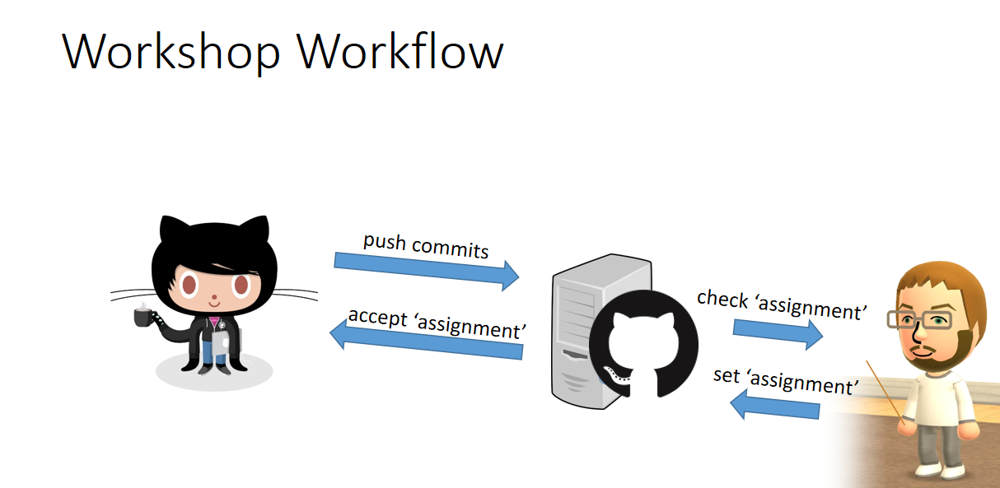

# BU1106 Task Introduction to GitHub

## Introduction

### Overview

This week we will start to work with GitHub, a code hosting platform for version control and collaboration.

### Editing

You can create documents and edit them directly in GitHub's web interface. This is a very convenient way of creating and editing the files. 
In most cases the preferred way of working is to create and edit the files on your own machine. 

To get the repository to your own machine you can use [GitHub Desktop](https://desktop.github.com/). 
There are other ways, but using GitHub Desktop is very convenient.

* You commit changes and push the commits to your GitHub account to create a history of the changes over time.
* You _can_ work on several machines and use commits as a way of keeping the files on different machines up to date. 

## Task Explanation

If you can read this you will have already accepted the task (GitHub calls it an assignment) on BlackBoard. You then had to create a GitHub account.

Below is today's task. For this task, you need to work in the file you are currently reading. It is a Markdown file. More explanations about the Markdown syntax can be found [on this page](https://guides.github.com/features/mastering-markdown/).

* Under the heading _Your Task_ you will find several questions. 
  * Use the GitHub web interface to add the first answer under one of the questions. 
  * It doesn't matter which question you answer first. 
* Commit after you gave the first answer. 
* Clone the repository to your local machine. 
  * If you have already cloned the repository to your local machine earlier make sure you do a fetch (fetch origin) so that you got the latest version of the file(s) on your machine before you continue.  
* This time work on the file(s) stored on your local machine and answer the rest of the questions. 
* Commit
* Push your Commits

**Commit early, commit often** - that way you can go back if you have made a mistake and I can see all the work you have done. There's no problem if you commit and there's a mistake in your file.  

Once you are done be sure to commit your changes (that will save them to the repository) and to push them to GitHub (so that I can see the work you have done).

## Your Task

#### Question 1

How many _Pages_ and how many _Content Pages_ are in our KMS (BU1106 Wiki)?
`Hint: You can use one of the _Special Pages_ to find out. `

**Answer:** Replace this text with your answer.

#### Question 2
What are the three _Most Wanted Pages_ are in our KMS (BU1106 Wiki), i.e. the pages we link to most, but that don't exist yet?
`Hint: You can use one of the _Special Pages_ to find out. If there are less than three give me all you found. `

**Answer:** Replace this text with your answer.

#### Question 3
Give me the names of three _Orphaned Pages_ are in our KMS (BU1106 Wiki), i.e. the pages that are not linked from or transcluded into other pages?
`Hint: You can use one of the _Special Pages_ to find out. `

**Answer:** Replace this text with your answer.